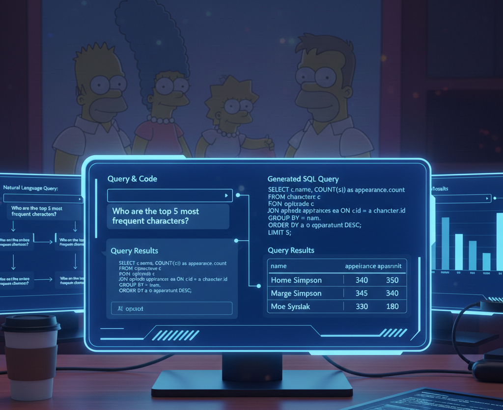

# Simpsons SQL Sorcerer (Natural Language to SQL Assistant)

[](https://www.python.org/)
[](https://forthebadge.com/generator)


[](https://gemini.google.com/app)  
*Image source: [Gemini](https://gemini.google.com/app)*

## Description
Querying databases typically requires technical knowledge of SQL syntax and schema structures. This project bridges that gap by creating an AI-powered assistant that converts plain English questions into executable SQL queries. Built using Python, LangChain, and SQLite, the system allows non-technical users to "chat" with their data, retrieving real-time results from a predefined dataset (e.g., The Simpsons database) without writing a single line of code.

## Installation

1. **Clone the project:**

```
    git clone https://github.com/butkutez/Natural-Language-to-SQL-Queries.git
    cd Natural-Language-To-SQL-Queries
```
2. **Create virtual environment (Windows)**
```
   python3.13 -m venv .venv
   .\.venv\Scripts\Activate.ps1
   ```

3. **Install dependencies**  
```
    pip install -r requirements.txt
```
4. **Initialize the Database**   
Before running the assistant, you must prepare the data. Run these scripts in order:

 - Download Data using Terminal - Fetch raw files from Kaggle (Make sure to adapt the code with your generated API key and Kaggle username).

```
    python setup.py
```

- Build SQLite DB (Processes CSVs into simpsons.db)

```
    python build_db.py
```

- Verify Schema (Optional: Check table structures)

```
    python exploring_schema.py
```
5. **Run the SQL Assistant** - Once the database is initialized, launch the interactive query tool:

```
    python main.py
```

## Repo Structure

```
NATURAL-LANGUAGE-TO-SQL-QUERIES
├── setup.py                 
├── build_db.py              
├── exploring_schema.py      
├── main.py                  
│
├── database_schema.txt      
├── assignment_results.txt   
│
├── requirements.txt         
├── .gitignore               
└── README.md
```

## Process & Methodology

```
┌──────────────┐      ┌────────────────┐      ┌──────────────┐      ┌──────────────┐
│  User Query  │ ──►  │   LLM Engine   │ ──►  │ SQLite Exec  │ ──►  │ Final Result │
│   (English)  │      │  (Text-to-SQL) │      │  (Python)    │      │ (Table/Data) │
└──────────────┘      └────────────────┘      └──────────────┘      └──────────────┘
 "Who is Lisa's        Prompt + Schema        Execute Generated     Visualized Result
   teacher?"              Inference               SQL Query
```
The application follows a modular "Pipeline" approach, where a natural language input is transformed into structured data through four distinct phases.

### **I. Secure Initialization & Context Loading**  
The system begins by loading environment variables via python-dotenv. A critical design choice was the use of a static schema reference (database_schema.txt).

**Why this is important**: Instead of querying the database for its structure every time (which is slow and resource-heavy), the script reads a pre-audited schema file. This provides the LLM with the exact table names and column types it needs to write accurate queries.

### **II. AI SQL Generation (The "Translator")**  
Using the google-genai client, the user's question is wrapped in a high-context prompt.

- Prompt Engineering: The prompt combines the content of the schema file with the user’s request, explicitly instructing the model to "Return only SQL".

- Post-Processing: Since LLMs often return Markdown formatting (like ```sql blocks), the code includes a cleaning step to strip these characters, ensuring the string is pure SQL ready for execution.

### **III. Database Execution Layer**  
The generated SQL is passed to a robust execution function using sqlite3.

- Safe Connection Management: The function uses a try...except...finally block. This ensures that the database connection is closed safely even if the AI generates a faulty query, preventing database locks and memory leaks.

- Error Handling: If the SQL is invalid, the system catches the exception and returns a readable error message rather than crashing the program.

### **IV. Data Persistence & Logging**
The final phase focuses on transparency and accountability.

- User Feedback: Results are iterated and displayed clearly in the terminal.

- Audit Trail: Every interaction is appended to assignment_results.txt. This creates a permanent log of the question asked, the SQL generated by Gemini, and the final data retrieved, which is essential for debugging and evaluating the model's performance over time.

## Dynamic Prompt Engineering
This snippet shows how the assistant gains "context" by reading the schema and instructing the Gemini model:

```python
def generate_sql(user_question):
    # Context-loading: Providing the LLM with the database structure
    schema = get_schema_from_file()
    prompt = f"Schema: {schema}\nRequest: {user_question}\nReturn only SQL."
    
    response = client.models.generate_content(
        model='gemini-2.0-flash', 
        contents=prompt
    )
    # Cleaning the output to ensure executable SQL
    return response.text.strip().replace("```sql", "").replace("```", "")
```
## Robust SQL Execution

This demonstrates your ability to manage database connections safely and handle potential AI-generated errors.

```python
def run_query(sql):
    conn = sqlite3.connect('simpsons.db')
    cursor = conn.cursor()
    try:
        cursor.execute(sql)
        return cursor.fetchall()
    except Exception as e:
        return f"SQL Error: {e}"
    finally:
        conn.close() # Ensuring connection closure to prevent database locks
```

##  Automated Audit Logging
This shows how you track the AI's performance and maintain a history of the "Question -> SQL -> Result" pipeline.

```python

with open("assignment_results.txt", "a", encoding="utf-8") as f:
    f.write(f"Q: {question}\nSQL: {sql}\nResult: {results}\n\n")
```

## **The Result:**  
By combining the Google Gemini 2.5 Flash model with a local SQLite database, I transformed a complex relational dataset into an accessible conversational interface. Users can now retrieve specific insights from the Simpsons universe (**or a database of your choice**) without knowing any SQL syntax.

**AI Query Execution:**  
The assistant successfully translates natural language into precise SQL filtering, JOINs and aggregations. Every successful translation is logged in ```assignment_results.txt```.

**Automated Audit Log:**  
The ```assignment_results.txt``` file serves as a persistent record of the AI's accuracy, capturing the user's intent, the generated logic, and the final data output.

## **Future Improvements:**  

- *Query Refinement Loop*: Implement a "self-healing" mechanism where the assistant tries to fix its own SQL if the initial execution returns a sqlite3 error.

- *Interactive UI*: Migration from a terminal-based input to a Streamlit or Gradio web interface for a more user-friendly experience.

- *Advanced Visualization*: Integrate matplotlib or seaborn to automatically generate charts (e.g., "Most frequent characters by season") when the query returns numerical data.


## **Timeline**
This solo project was completed over 1 day.

## **Personal Situation**
This project was completed as part of the AI & Data Science Bootcamp at BeCode.org.

**Connect** with me on [LinkedIn](https://www.linkedin.com/in/zivile-butkute/).